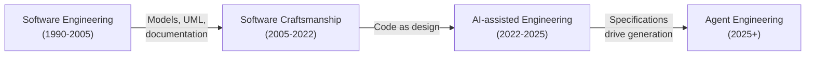
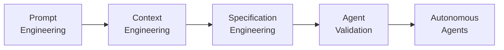
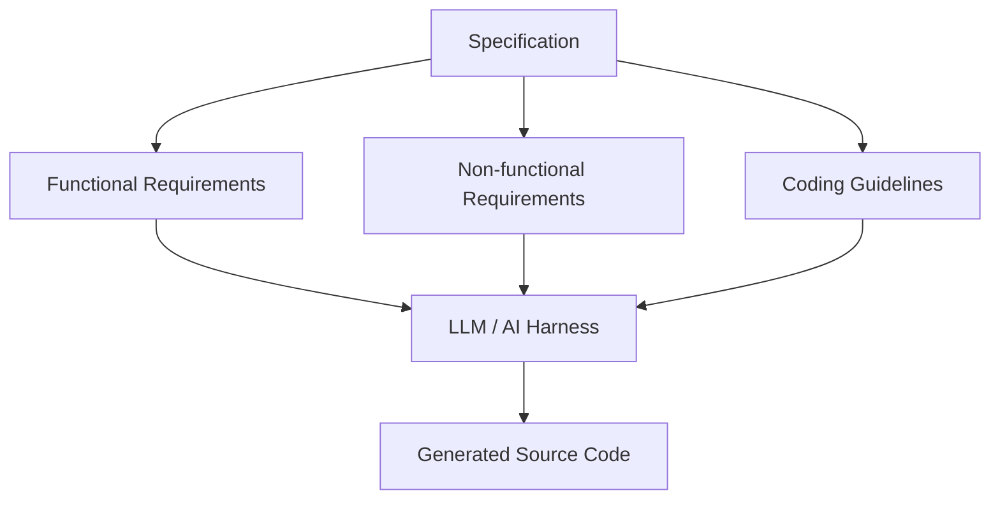
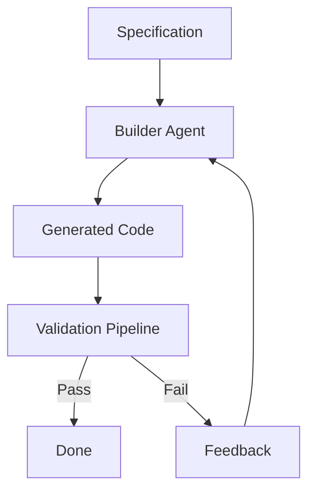
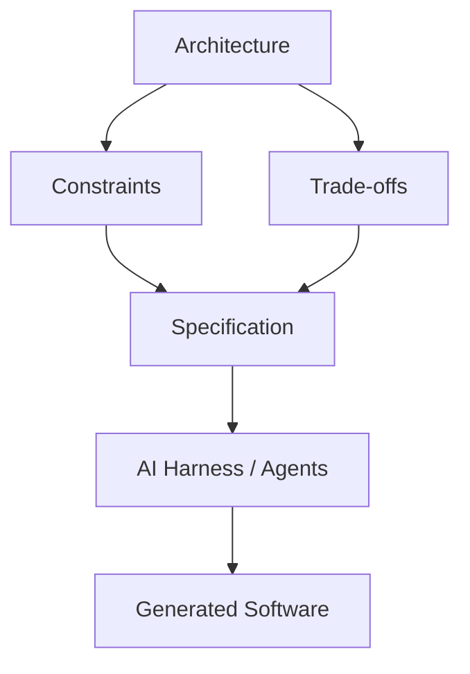

# Software Engineering Beyond Code
Since the eruption of LLMs in 2022, Software Engineering has been evolving faster than at any other point in its short history.
Now, more code than ever is being produced by leveraging Large Language Models from AI companies. But does it mean that Software Engineering is in crisis?
Is it going to disappear? Are we engineers going to stop coding?

## Introduction
In this post we are going to talk about how Software Engineering is being impacted by the AI revolution based on the Large Language Models
(LLMs) that we are living through today (2022-2026).

## Software Engineering: the two tribes
Almost 20 years ago, when they taught me Software Engineering, there was a conflict among practitioners:
the purists, and the crafters.

The **purists** argued that code was destined to become a commodity and that the coding process would be minimized,
leaving engineers with the high-level design of the system. UML and other tools were created as a way to have a common language
that allowed software engineers to define their systems fully (or as much as possible) without writing source code.
They were inspired by traditional engineers and considered code to be the building blocks of the system. Some of them
considered that an engineer must not program themselves, but rather that a lower-level technician should do it
(following the engineer's directions). Traditional engineers worked that way, so they took that approach.

The **crafters** dismissed the efforts of the purists and
considered them *fools* in their own *Ivory tower*, while they were worried about creating functional software by coding it.
They usually did not make a distinction between programming and software engineering.

They argued that source code itself was the one and only true software design[^1].

Of course this is an oversimplification, and most people had elements of each group[^2], but you get the idea.

In my university days, I was taught by purists, but I soon discovered that the world did not need people who could
create nice diagrams and documents, but code.

## The industry embraced the software craftsmanship movement
During this period, Agile Methodologies grew in popularity as a response to the failures to deliver projects without delays
and on budget that were happening in software engineering: 

> Individuals and interactions over processes and tools
> Working software over comprehensive documentation
> Customer collaboration over contract negotiation
> Responding to change over following a plan
> 
> Agile Manifesto 2001

UML lost its place as a foundational part of software engineering, and with it, most frameworks of software design.
All artifacts of the Software Development Process that were not part of the final product were minimized or
eventually removed. The code would be the central piece of the puzzle, and any other pieces could be discarded[^3].

The code became ultimately the most valuable piece of the system. The functionality
was in the source code, and indeed one could argue that *the code itself contained the design of the system*[^4].

## Programming became the cornerstone in many companies
Big companies had more complex processes where programming was only a stage. They had to deal with distributed systems,
performance, reliability, consistency, and observability as crucial parts of their software development process. It is the
old adage: *the problem many times is not the problem itself, but its scale*.

However, most companies are not Google, nor Microsoft. Software Engineering became equated to programming
in most small and mid-sized companies.

A great implementer became a great *Software Engineer*. From the interview process based on programming puzzles,
to being able to solve problems with code, programming became the cornerstone of the discipline.
The rest of the activities would be done by other actors (Product Managers, Project Managers, etc.) or simply... were not done.

A lot of programmers called themselves *Software Engineers*, simply because they
knew how to program. Maybe they did not know about algebra, Big-O notation, logic, or state machines. It did not matter.
They could produce code.

Other engineering disciplines have a foundation in physics, but the foundations of software engineering are in mathematics.
As a young discipline, it was still very dependent on heuristics, so anybody without a strong foundation in science
could learn the heuristics and apply them, doing acceptable work.

I grew tired of defending that Software Engineering is a legitimate discipline based on mathematics and logic. Real engineering
comes with constraints on resources: computational, cognitive, and human usability limits. Now this is something I no longer discuss.

## LLMs change the game
When LLMs entered Software Engineering, they succeeded in shifting the focus from the code to the input provided to the LLM.

So we have come back to a point where the *purists* were (partially) right. They did not expect to have machines that could
ingest text and generate source code (most code generation tools were diagram-based), but the effect is the same.
**The source code has changed from being considered the design to being considered the end result.**

Nowadays, some people are saying that Software Engineering was never about programming, or that coding was the easy part.
I disagree with that opinion. While programming is only one of the activities of software engineers, there are others like
requirements gathering, user experience, and system design that fall outside the scope of raw coding.

## How we use LLMs evolved
Not only did technology change how we generated code, but it also changed how we used LLMs themselves.

First to the [prompt](https://en.wikipedia.org/wiki/Prompt_engineering),
then to [specification](https://en.wikipedia.org/wiki/Specification-driven_development), and now to agent engineering, leading toward dark factories.

### Prompt engineering
It all started by having a conversation with the LLM. Just by typing messages and receiving responses we were able
to extract value from the LLM.

An important piece here is the AI Harness: an application running on our machine that provides interaction between
the LLM and our files. Surely you have read about Claude Code, OpenCode, or Codex. All of them are AI harnesses.

Before AI harnesses, we would just copy-paste blocks of code from the chat window into our files[^5].

### Context engineering
There are several principles that most people do not get:

- LLMs do not maintain state on the servers between requests. We send the entire conversation back to them again and again, converted into tokens. This is called context.
- LLMs have a limit on the number of tokens they can manage (as of July 2026, most providers accept 1M tokens).

All the techniques that manage and optimize this context constitute context engineering.

Defining skills, splitting context across several files so the agent only reads what it needs,
or compacting context are among the most popular techniques in context engineering[^6].

### Spec engineering
Instead of relying on a conversation, we can define a specification document detailing the
functional requirements (what we want) and non-functional requirements (how we want it).

This document can also contain guidelines about how source code must be structured, which design patterns to use,
or even the linting rules the LLM must satisfy.

At the end of the day, the specification becomes an executable asset,
because **we treat the LLM as a compiler of specification documents**[^7].

Readers familiar with the Waterfall method of software development might feel this approach sounds familiar and flawed.

### Agent validation
Even if we occasionally prompt to redirect the LLM when it strays off course, we need automated assurance that the generated code
implements a feature correctly.

Whether using human-in-the-loop (open loop) or fully unsupervised (closed loop) approaches, we cannot rely solely on human inspection for code verification. A human can check for general patterns,
but cannot mentally trace every execution path to catch subtle errors.

This validation process must rigorously check whether the generated code accomplishes its goals.
Crucially, the validation suite should be generated from the specification by a separate agent from the one building the implementation.

We aim to develop a validation process derived from a clear specification, independent of the source code implementation.

### Autonomous agents
The primary bottleneck is the human providing information to the LLM. Not only because writing specs manually is slow,
but because human specifications can be incomplete, inaccurate, or miss critical edge cases[^8].

What if we could let the LLM work autonomously, with minimal or zero human intervention?

A closed loop where one LLM agent generates code, another agent[^9] generates the tests, and a validation pipeline runs automated checks.

With a strong validation process, omissions in the initial specification can be surfaced and resolved automatically.
Although the specification remains the primary artifact,
we can rely on an iterative loop where agents improve both the code and the specification itself.

One key part of the specification that evolves is the validation framework itself. A robust validation process is the
foundation upon which autonomous loops depend.

## What now?

### Architecture takes the stage
A well-designed architecture allows a system to scale, evolve, and remain maintainable over time.

An LLM can create a web service in seconds. However, decisions about service boundaries,
communication patterns, observability, data ownership, and architectural trade-offs must ultimately be made by a software engineer.

Architecture is now part of the specification at system scale, guiding the LLM to generate software according to decisions and trade-offs set by software engineers.

### Experiment
Now is the time to experiment by pushing LLMs to their limits. Code generation is becoming the easy part;
the hard part is guiding and validating LLMs effectively.

### Are software engineers obsolete?
No. Their role has fundamentally evolved. Engineers now write less boilerplate code, review more, and author higher-level specifications for autonomous AI systems. Source code was never the end goal; it was only the means.
The ultimate goal is solving real-world problems and delivering value through software. It does not matter who wrote the software or what underlying technology was used.

## Conclusion
The software engineering profession evolved from a young discipline inspired by traditional engineering into one focused primarily on source code. Now, it is returning to a classic engineering model where source code acts more like *bricks* than the finished structure.

While programming was once the central activity of Software Engineering, the focus is now shifting to AI-driven processes that produce software.

Do civil engineers lay bricks? Do electronic engineers fabricate every transistor they use in their circuits?
Software engineers will increasingly shift their focus from writing code to defining specifications, building validation systems, and designing AI harnesses that reliably produce software.

[^1]: This position was defended by Jack Reeves in his article [*What is Software Design*](https://www.developerdotstar.com/mag/articles/PDF/DevDotStar_Reeves_CodeAsDesign.pdf)

[^2]: Indeed, I consider myself part of both groups. In recent years I focused primarily on code as design,
but early in my career I was obsessed with UML, code generation, Model-Driven Architecture, and all kinds of 
standardizations and automations.

[^3]: I remember during my first job (2008) trying to encourage the use of UML or C4, reports, documentation, etc.
Most developers just *shrugged* and ignored me. They were not interested in diagrams, but in the project itself (hence the code).

[^4]: You could argue that code is too low-level to easily reveal high-level design, but the patterns are there,
and code doesn't lie. Diagrams and implementations frequently drift apart.

[^5]: Not long ago (early 2025), I was developing a CLI tool in Golang and Cobra. I was asking ChatGPT
to give me the skeleton of new actions, and copy-pasting them into the source files. Looking back, it feels
as if I were a caveman using powerful alien technology.

[^6]: I predict that context engineering will improve exponentially once high-tier LLMs run locally on our
laptops. Compacting context locally without sending everything to a cloud provider will save massive amounts of tokens.

[^7]: LLMs are inherently non-deterministic, so we are dealing with a compiler of human language that can produce varied outputs across runs.

[^8]: Remember Donald Rumsfeld's famous statement on [unknown unknowns](https://en.wikipedia.org/wiki/There_are_unknown_unknowns).

[^9]: To write proper tests, generator and validator agents must be separated. This prevents implementation leakage into the test suite and ensures tests evaluate contracts rather than internal mechanics.
